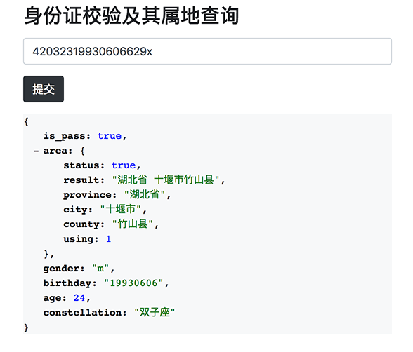

# Identity-Card [id.js]


[![NPM version][npm-badge]][npm-url]
[![NPM downloads][npm-downloads]][npm-url]
[![Jsdelivr cdn][jsdelivr-badge]][jsdelivr-url]

[npm-badge]: https://img.shields.io/npm/v/identity-card.svg?style=flat
[npm-url]: https://www.npmjs.com/package/identity-card
[npm-downloads]: http://img.shields.io/npm/dm/identity-card.svg?style=flat
[jsdelivr-badge]: https://data.jsdelivr.com/v1/package/npm/identity-card/badge?style=rounded
[jsdelivr-url]: https://www.jsdelivr.com/package/npm/identity-card


>   身份证校验及其属地查询类库， 是对PHP [douyasi/identity-card](https://github.com/douyasi/identity-card) 包的 `Typescript/Node/Javascript` 实现版本 。




PS : 本来包名想叫 `idjs` 或 `id.js` 的，但是 `npm` 有相似包名不允许上传，所以干脆跟 `php` 包名相同了。


### 安装与使用

使用 `npm` 下载安装：

```
npm install identity-card
cd node_modules/identity-card
```

使用 `git` 下载安装：

```shell
git clone https://github.com/ycrao/id.js
cd id.js
npm install
```

使用命令：

```
npm link
# 命令行工具
id-parse
# 编译所有
npm run build
# 使用tsc编译 [会覆盖 dist 目录下 js 文件]
npm run build:tsc
# 使用webpack编译压缩 [会覆盖 id.min.js 文件]
npm run build:webpack
# 执行开发测试 [使用 node 和 ts-node 运行示例代码]
npm run dev
npm run ts-dev
```

### 命令行工具

```shell
id-parse

  Usage: id-parse [options]

  Options:

    -V, --version  output the version number
    -h, --help     output usage information
    {identity card number}  Get identity card number information

  Example:

    id-parse 42032319930606629x
```

### 数据回显

在终端运行 `id-parse 42032319930606629X` 命令，会回显以下数据：

```shell
identity card number is 42032319930606629X
{ is_pass: true,
  area:
   { status: true,
     result: '湖北省 十堰市竹山县',
     province: '湖北省',
     city: '十堰市',
     county: '竹山县',
     using: 1 },
  gender: 'm',
  birthday: '19930606',
  age: 24,
  constellation: '双子座' }
```

### 浏览器端使用

已提供浏览器端 `id.min.js` ，请参考 `example/index.html` 示例使用。

```
<!DOCTYPE html>
<html lang="en">
<head>
    <meta charset="UTF-8">
    <title>demo</title>
    <script type="text/javascript" src="../id.min.js"></script>
</head>
<body>
    <script>
    var IdCard = '42032319930606629x';
    var id = new IdentityCard(IdCard);
    console.log('identity card number:', IdCard);
    console.log('result: %j', id.info());
    </script>
</body>
</html>
```

`IdentityCard` 类暴露以下公共方法，注意，请在调用 `validate()` 为 `true` 之后，再调用其它获取信息接口。

 - validate() : 校验结果
 - info() : 所有信息组合
 - area() : 归属地信息
 - gender() : 性别
 - age() : 年龄
 - birthday() : 生日
 - constellation() : 星座


### 其他版本实现

- PHP实现版本 [douyasi/identity-card](https://github.com/douyasi/identity-card)
- RUST实现版本 [idrs](https://github.com/ycrao/idrs)

### 联系作者

>   Email: raoyc2009#gmail.com （请修改改`#` 为`@`）  
